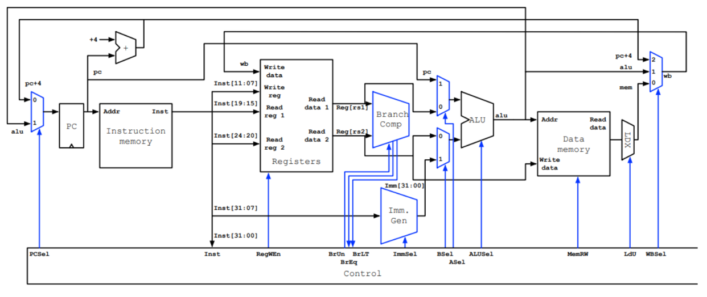

# KLP32V1 RISC-V RV32I Processor
By Kiet Le & Lawrence Prophete

## About
This project implements a simple RISC-V processor for FPGAs. It supports the RV32I base instruction set and is designed for educational and experimental purposes.
This projects was developed with Intel Quartus and Simulated on the DE10-Lite Board. 

## Getting Started

### Prerequisites
- Quartus Prime Lite Edition 20.1
- ModelSim or another simulator

### File Structure
      .
      ├── .github                 # Github Actions
      │   └── workflows
      │   │   └── compile-pr.yml  # Pull Request Quartus Compiling Checker
      ├── alu-modules             # ALU Verilog Modules
      ├── general-modules         # Major Verilog modules (i.e., ALU, Register File, etc.)
      ├── misc-modules            # Miscellaneous Verilog modules (i.e., Muxes)
      ├── KLP32V1.qpf             # Quartus Project File
      ├── KLP32V1.qsf             # Quartus Settings File
      ├── KLP32V1.v               # Main processor file
      └── README.md

### Microarchitecture

Image credit: EECS4201: Computer Architecture, Sebastian Magierowski, York University.
